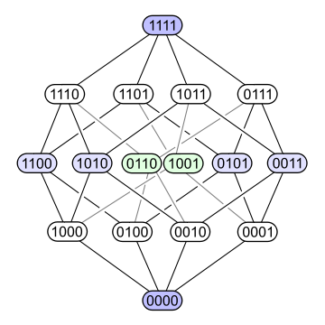
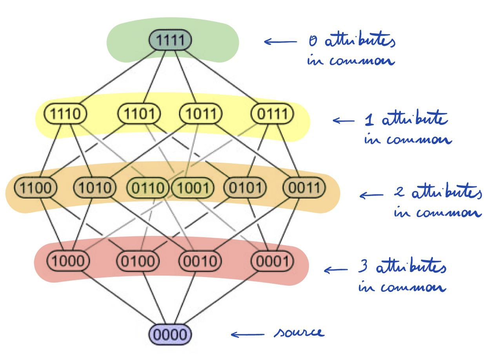
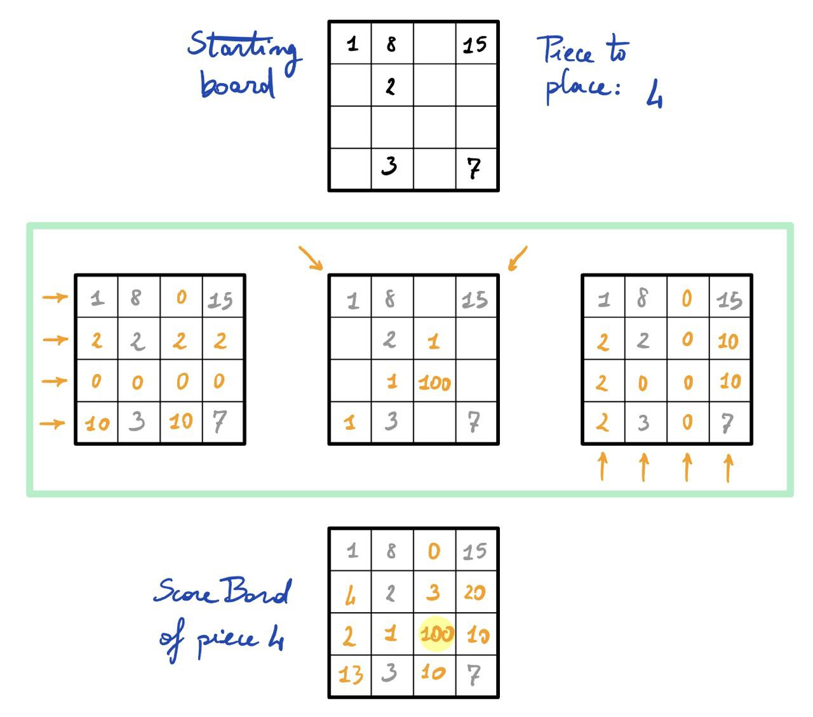

# __Computational Intelligence - Exam Report__  

> __Luigi Federico, s295740__ 
> - Exam Project Repository (private): https://github.com/LuigiFederico/Computational_Intelligence_Exam
> - Course Repository (public): https://github.com/LuigiFederico/Computational-Intelligence 

---
---

## __1 - Introduction__    

The agent is build using an heuristic strategy based on pareto fronts idea and using MinMax with alpha-beta pruning and both horizontal and deep pruning. 

The method section illustrates in detail how the agent works and all the strategies that I developed. Next, the Experiment section contains a tuning experiment and the results against the Random Agent. The code is at the end of this report, followed by all the laboratory reports and reviews.


## __2 - Method__  

The agent uses two different approaches depending on which mode it is in. There could be two different modes:  

- Safe Mode
- Threat Mode

The agent is in Threat Mode if there is at least one __threat piece__. A threat piece is a piece that, if placed in a line with 3 pieces, will result in a quarto. If there are no threat pieces, the agent is in Safe Mode.  

The agent will act differently according to the mode it is in:
- When it is in safe mode it will use an __euristic strategy__ that tries to map the board state to a score board, based on the frontiers idea (see 2.1 - Frontiers and Score Board). This stands for both choosing and placing a piece. 
- When it is in threat mode it will run a __MinMax algorithm__ that uses alpha-beta pruning and both deep and horizontal pruning with a greedy sorting based on the Score Board to speed up the prunings (see 2.2 - MinMax).


### __2.1 - Frontiers and Score Board__  

The idea of piece frontiers comes after reading the reference [1] ["Quarto, Part 1 (Theory)"](https://stmorse.github.io/journal/quarto-part1.html) by Steven Morse in which he tries to analyes the math behind quarto. Here is the extract that inspired me: 

>
> [...]  
> << We’d like to relate the space to some object, and then use a well known dihedral group to represent the symmetries. (Instead of using a clunky flat matrix.) A good analogy is to use a 4-cube, or tesseract, and think of the binary numbers as the coordinates of the vertices of the cube in 4-space. Then if you choose a vertex _v_, *A_v* are the adjacent vertices, *B_v* are the vertices 2 steps away, *C_v* are the vertices 3 steps away, and *D_v* is the vertex on the opposite side of the 4-cube. Thus, _H_ seems to be the dihedral group of a 4-cube.
>
> 
>
> Like all things, in hindsight, this is quite obvious. We have a 16-element set, and we are trying to identify symmetries. Of course this should correspond to the 16-element set called the coordinates of a 4-cube in Euclidean space! Of course! >>


The idea of the frontiers comes with this hypercube configuration. We can distinguish 4 frontiers, ordered by the number of attributes shared with the source piece. The higher the number of shared attributes, the higher the advantage to place the frontier piece in the same line of the source. Here is a better rapresentation of the frontiers:



If we place the piece with 0 common attributes in the same line of the source piece, we "disable" the line becouse no matter what piece the agent places in that line, it will never give a quarto. If we want to place a piece safely we could choose a disabled line.

For each frontier it doesn't matter which piece you choose, because it will share exactly that number of attributes with the source. This configuration is a sort of __Pareto Front__ system.

We can compute the frontiers of more than one piece as source. The sources can be at most three, becouse after that a line is disabled and it doesn't make sense to think about frontiers since you can't place any other piece. There are exacly 696 possible sources (16 with one piece, 120 with two pieces and 560 with three pieces) so they can be easly computed and mantained by the agent during the games.

The code I used to compute statically the frontiers is the following: 

```Python
@staticmethod
def get_frontiers():
    """
        Generates all the frontiers for each possible combination of 1, 2 and 3 elements.

        Returns a dictionary frontiers with:
        - key = tuple containing the source pieces of the respetive frontiers. Could have len = 1, 2 or 3.
        - value: the frontier corresponding to the source pieces as a dictionary with:
            - key: number of attributes in common with the pieces inside the level of the frontier. key = 0, 1, 2 or 3.
            - value: pieces that share key elements in common with the source pieces.
    """
    
    def get_frontier(p: int):
        """ Frontiers with 1 piece """
        assert p >= 0 and p <= 15

        x = dec_to_bin[p]
        frontier = {
            0: [],
            1: [],
            2: [],
            3: []
        }

        for num, binary in dec_to_bin.items():
            if num == p:
                continue
            cnt = 0
            for i, j in zip(x, binary):
                if i == j:
                    cnt += 1
            frontier[cnt].append(num)
        
        return frontier

    def get_frontier_2d(a: int, b:int):
        """ Frontiers with 2 pieces """
        assert a >= 0 and a <= 15
        assert b >= 0 and b <= 15
        assert a != b

        x = dec_to_bin[a]
        y = dec_to_bin[b]
        frontier = {
            0: [],
            1: [],
            2: [],
            3: []
        }

        for num, binary in dec_to_bin.items():
            if num == a or num == b:
                continue
            cnt = 0
            for x_i, y_i, j in zip(x, y, binary):
                if x_i == j and y_i == j:
                    cnt += 1
            frontier[cnt].append(num)
        
        return frontier

    def get_frontier_3d(a: int, b:int, c: int):
        """ Frontiers with 3 pieces """
        assert a >= 0 and a <= 15
        assert b >= 0 and b <= 15
        assert c >= 0 and c <= 15
        assert a != b and a != c and b != c

        x = dec_to_bin[a]
        y = dec_to_bin[b]
        z = dec_to_bin[c]
        frontier = {
            0: [],
            1: [],
            2: [],
            3: []
        }

        for num, binary in dec_to_bin.items():
            if num == a or num == b or num == c:
                continue
            cnt = 0
            for x_i, y_i, z_i, j in zip(x, y, z, binary):
                if x_i == j and y_i == j and z_i == j:
                    cnt += 1
            frontier[cnt].append(num)
        
        return frontier

    frontier = {}

    # one piece -> 16
    for p in range(16):
        frontier[(p, )] = get_frontier(p)
    
    # two pieces -> 120 combinations
    for i in range(16):
        for j in range(i+1, 16):
            frontier[(i, j)] = get_frontier_2d(i, j)

    # three pieces -> 560 combinations
    for i in range(16):
        for j in range(i+1, 16):
            for k in range(j+1, 16):
                frontier[(i, j, k)] = get_frontier_3d(i, j, k)
                
    return frontier

```

Using frontiers it's easy and fast to distinguish the threat pieces from the safe ones. A threat piece would share at least one attribute with a source of three pieces. If a line has three pieces and there is at least one threat piece, than the agent enters in threat mode. 

The agent uses the following method to distinguish the pieces: 

```Python
def distinguish_pieces(self, board):
    """ Returns a list of safe pieces and a list of threat pieces """

    threat = set()

    # Rows
    for row in range(board.shape[0]):
        k = tuple(sorted([p for p in board[row, :] if p != -1])) # frontier source (key)
        if len(k) == 3: # Threat line
            k_threat = set(self.frontiers[k][1]) | set(self.frontiers[k][2])  # pieces with attributes in common with all of 3
            threat |= k_threat

    # Cols
    for col in range(board.shape[1]):
        k = tuple(sorted([p for p in board[:, col] if p != -1]))
        if len(k) == 3: # Threat line
            k_threat = set(self.frontiers[k][1]) | set(self.frontiers[k][2])  # pieces with attributes in common with all of 3
            threat |= k_threat
    
    # Diag 1
    k = tuple(sorted([p for p in board.diagonal() if p != -1]))    
    if len(k) == 3: # Threat line
        k_threat = set(self.frontiers[k][1]) | set(self.frontiers[k][2])  # pieces with attributes in common with all of 3
        threat |= k_threat

    # Diag 2   
    k = tuple(sorted([p for p in np.fliplr(board).diagonal() if p != -1]))  
    if len(k) == 3: # Threat line
        k_threat = set(self.frontiers[k][1]) | set(self.frontiers[k][2])  # pieces with attributes in common with all of 3
        threat |= k_threat   
    

    # Clean up
    safe = set(range(16))
    placed = set([int(p) for p in np.nditer(board) if p != -1])
    threat -= placed
    safe -= placed
    safe -= threat
    
    return list(safe), list(threat)

```

Using the frontiers it is possible to map how much "dangerous" is to place a piece on a specific position of the board. When we have to place a piece, we can compute for each line how many attributes would be shared with the placed pieces on that line, i.e. on which frontier the piece to place is, using the placed pieces as source, and then we multiply that number for a scaling factor. This scaling factor is equal to 100 if the source is compoused of 3 pieces, 10 if the source has 2 pieces and 1 if the source is just one piece. This scaling factor highlights the board positions where is more likely to find a quarto after the placing. If we have a number in the hundreds, we have a winning condition: place the piece there and you will have a quarto! If the number is in the tens, than the higher it is the more probable it is to create a quarto condition on multiple lines. At the end, the scores computer for each line are summed togheter on the board. Here is a quick illustration to visualize the procedure:  



The method used by the agent to compute the score board is the following:

```Python
def __board_intersection_scores(self, piece: int):
    """
        Computes the mapping of the board with scores in it using the frontiers
    """

    def extract_source(board_slice) -> tuple:
        """ Extracts the a key for self.frontiers """
        k = tuple(sorted([p for p in board_slice if p != -1]))
        return k

    def compute_score(frontier) -> int:
        rank = -1                           # Frontier rank = number of common attributes with piece
        for i in range(4):
            if piece in frontier[i]:
                rank = i
                break

        rescaling = 10**(len(k) - 1)
        score = rank * rescaling
        return score
        

    # Setup
    board = self.get_game().get_board_status()
    board_scores = np.zeros(shape=(Quarto.BOARD_SIDE, Quarto.BOARD_SIDE), dtype=int)   # Initialized mapped board

    # Rows
    for row in range(board.shape[0]):
        k = extract_source(board[row, :])   # Extract the frontier's source
        if k == () or len(k) == 4:
            continue 
        score = compute_score(self.frontiers[k]) 
        board_scores[row, :] += score
    
    # Cols
    for col in range(board.shape[1]):
        k = extract_source(board[:, col])       
        if k == () or len(k) == 4:
            continue 
        score = compute_score(self.frontiers[k]) 
        board_scores[:, col] += score      

    # Diag 1
    k = extract_source(board.diagonal())    
    if k != () and len(k) != 4:
        score = compute_score(self.frontiers[k]) 
        tmp = np.zeros((4, 4), dtype=int)   # Update the diagonal
        np.fill_diagonal(tmp, score)
        board_scores += tmp

    # Diag 2   
    k = extract_source(np.fliplr(board).diagonal())       
    if k != () and len(k) != 4:
        score = compute_score(self.frontiers[k]) 
        tmp = np.zeros((4, 4), dtype=int)      
        np.fill_diagonal(np.fliplr(tmp), score)
        board_scores += tmp

    # Clean up board_scores
    mask = np.array(board == -1, dtype=int)     # 0 if there is a piece in the i,j board coordinate, 1 otherwise
    board_scores = board_scores * mask

    return board_scores

```

I used this score board strategy as base line for the heuristic strategy that the agent uses at safe mode:

- When the agent has to place a piece it computes all the possible actions and sorts them by ascending score and takes the action with the lowest score. This should delay as much as possible the threat mode strategy, in order to have a board configuration that is not too heavy for the MinMax algorithm to explore. It is also possible to sort the actions in descending mode, trying to create as soon as possible a threat line. In the experiment section (3 - Experiments) we can see that it is better to delay the MinMax computation in order to have faster agent moves. The method used for the "safe mode place piece" is the following:

```Python
def __safe_mode_place_piece(self, piece: int, *, delay_minmax = True) -> tuple[int, int]:
    
    # Setup
    board = self.get_game().get_board_status()    
    possible_actions = self.__list_ply_score(board, piece)

    # Sort the action 
    if delay_minmax:
        possible_actions = sorted(possible_actions, key=lambda a: a[1])    # ascending score (MinMax delayed amap)
    else:
        possible_actions = sorted(possible_actions, key=lambda a: -a[1])   # descending score (MinMax asap) 

    # Check if the action is safe (if there are enough pieces to choose)
    idx = 0
    ply, score = possible_actions[idx]

    while (self.__check_place_ply(ply, piece) == False):
        idx += 1
        if idx < len(possible_actions): 
            ply, score = possible_actions[idx]
        else:
            break

    return ply


def __list_ply_score(self, board, piece):
    """
        List all the possible positions where to place the piece with score as tuples ((x,y), score)
    """
    possible_actions = []
    score_board = self.__board_intersection_scores(piece)

    for row in range(board.shape[0]):
        for col in range(board.shape[1]):
            if board[row, col] == -1:       # Possible action
                possible_actions.append( ((row, col), score_board[row, col]) )
    
    return possible_actions

def __check_place_ply(self, ply: tuple[int, int], piece: int, *, safe_threshold = 1):
    """ 
        Returns True if there are enough safe pieces to choose after placing 
        the given piece on board using the ply coordinates.
    """
    board = self.get_game().get_board_status() 

    assert board[ply[0], ply[1]] == -1  # The ply must be legal
    
    board[ply[0], ply[1]] = piece
    safe, _ = self.distinguish_pieces(board)

    # I want enough safe pieces to choose after having placed the given piece on the board
    if len(safe) >= safe_threshold:
        return True
    else:
        return False

```

- When the agent has to choose a piece in safe mode, it computes for each piece the total score and chooses the one with the minimum. This should result on giving the piece that gives the less advantage possible to the opponent and that delays the threat mode configuration as much as possible. The method that computes this is the following:

```Python
def __safe_mode_choose_piece(self, safe_pool) -> int:
    """ 
        Retrieves the piece with the lowest total score computed using the frontiers.
        This should be the piece that gives to the opponent the lowest advantage.
    """
    best_piece = -1
    best_score = 500
    
    for p in iter(safe_pool):   # Min search
        board_score = self.__board_intersection_scores(p)
        score = board_score.sum()
        if score < best_score:
            best_piece = p

    return best_piece
```

### __2.2 - MinMax__    

When the agent is in Threat Mode it runs the MinMax algorithm to find the best ply possible. In order to have reasonable timings, I adopted the alpha-beta pruning and both deep and horizontal pruning.

Deep pruning follows a static approach: once it reaches `MINMAX_MAX_DEPTH`, it will stop expanding the game tree. After some tuning I found that MINMAX_MAX_DEPTH = 2 was the best compromise between exploration and time efficiency. Note that the reached depth is actually 3, becouse the algorithm starts the search using a counter that starts form 0.

Horizontal pruning uses a greedy heuristics hoping to help the alpha-beta pruning:
- When it has to place a piece, it sorts all the possible actions on descending order, exploring first the plys that could lead faster to a quarto. The horizontal pruning consists on exploring only the plys that has score greater than 0, becouse the cutted plys could need too much exploration and it could not be worth to explore them.
- When it has to choose a piece, it computes the total score for each safe piece and sort them in descending order. It explores first the pieces that could lead faster to a quarto. This is not an horizontal pruning but an heuristic that tries to help the alpha-beta pruning by finding as soon as possible a winning condition.

The used methods are the following:

```Python

def min_max_place_piece(self, board_now, piece, player, cnt=0):
    """
        MinMax algorithm with alpha-beta pruning, deep pruning, horizontal pruning and greedy sorting for placing a piece.

        The greedy sorting tryes to speed up MinMax by sorting the possible actions by 
        the corresponding score computed with self.__list_ply_score(•).
        IDEA: Expand first the actions that could lead faster to a winning/drow condition,
        hoping to favor the alpha-beta pruning. 

        Args:
        - board -> current state of the board (numpy.ndarray)
        - piece -> piece to place (int)
        - player -> 0: my agent, 1: opponent

        Returns:
        - ply = coordinates as tuple es. (x, y)
        - piece = best piece to give associated with the best ply
        - score -> WIN = 5, LOSE = -5, DROW = 1
    """

    possible_actions = self.__list_ply_score(board_now, piece)          # Descending score:
    possible_actions = sorted(possible_actions, key=lambda a: a[1])     # Greedy sorting to speed up alpha-beta pruning

    if cnt > self.MINMAX_MAX_DEPTH:
        return possible_actions[0], -1, 0

    possible_actions = [a for a in possible_actions if a[1] > 0]        # Horizontal pruning
    ply_drow = (-1, -1)
    piece_drow = -1
    best_score = 0

    for ply, _ in iter(possible_actions):
        if board_now[ply[0], ply[1]] != -1:     # Check that the ply is legal
            continue
        board = deepcopy(board_now)             # Ply     
        board[ply[0], ply[1]] = piece
        
        if self.check_finished(board):               # Termination
            if player == 0:
                return ply, -1, WIN
            else:
                return ply, -1, LOSE
        
        piece, score = self.min_max_choose_piece(board, player, cnt)  # Recursion
        
        
        if score == WIN and player == 0:        # Alpha-Beta Pruning
            return ply, piece, WIN
        if score == LOSE and player == 1:
            return ply, piece, LOSE
        # If drow or else, keep looking for a better ply
        ply_drow = ply
        piece_drow = piece
        if score == DROW:
            best_score = DROW

    # No winning condition -> drow 
    return ply_drow, piece_drow, best_score

    
def check_finished(self, board):
    """ Returns True if the board is a winning condition, False otherwise """

    def __check(k):
        for attribute in range(4):
            sum = 0
            for idx in range(4):                      
                sum += dec_to_bin[ k[idx] ][attribute]
            if sum == 4 or sum == 0:    # Winning condition
                return True

    # Rows
    for row in range(board.shape[0]):
        k = tuple(sorted([p for p in board[row, :] if p != -1]))
        if len(k) == 4 and __check(k):
            return True

    # Cols
    for col in range(board.shape[1]):
        k = tuple(sorted([p for p in board[:, col] if p != -1]))
        if len(k) == 4 and __check(k):
            return True

    # Diag 1
    k = tuple(sorted([p for p in board.diagonal() if p != -1]))
    if len(k) == 4 and __check(k):
        return True

    # Diag 2
    k = tuple(sorted([p for p in np.fliplr(board).diagonal() if p != -1]))
    if len(k) == 4 and __check(k):
        return True    
                    
    return False
```


```Python
def min_max_choose_piece(self, board, player, cnt=0):
    """
        MinMax algorithm for choosing a piece with alpha-beta pruning and greedy sorting.

        The greedy sorting tryes to speed up MinMax by sorting the safe pieces (the only one expanded)
        by decreasing score. The score is computed as sum of the scores inside the board_score computed 
        by self.__board_intersection_scores(p) for each piece p in the safe pool.
        IDEA: look for pieces that offer more aggressive plays hoping to find faster a winning/drow condition
        in oreder to assist the alpha-beta pruning.

        Args:
        - board -> current state of the board, after having placed the previous given piece (np.ndarray)
        - player -> 0: my agent, 1: opponent

        Returns:
        - piece = choosen piece
        - score -> WIN = 5, LOSE = -5, DROW = 1
    """

    safe, threat = self.distinguish_pieces(board)   # Threat and safe pieces pools

    # Terminations
    if len(safe) + len(threat) == 0:
        return -1, DROW

    if len(safe) == 0:
        if player == 0:
            return threat[0], LOSE
        else:
            return threat[0], WIN
    
    if cnt > self.MINMAX_MAX_DEPTH:
        return safe[0], 0

    # Greedy sorting to speed up MinMax pruning
    piece_score = []
    for p in iter(safe):
        board_score = self.__board_intersection_scores(p)
        piece_score.append((p, board_score.sum()))
    piece_score = sorted(piece_score, key=lambda x: -x[1])   # Descending order

    # Recursion
    best_piece = -1
    best_score = []
    for piece, _ in iter(piece_score):
        _, _, score = self.min_max_place_piece(board, piece, (player + 1) % 2, cnt+1)  
        
        if player == 0 and score == WIN:        # Alpha-Beta Pruning
            return piece, WIN
        if player == 1 and score == LOSE:
            return piece, LOSE
        # If drow or else, keep looking
        best_piece = piece
        if score == DROW:
            best_score = DROW

    # No winning condition -> drow 
    return best_piece, best_score

```


### __2.3 - Place piece__

As already said, if the agent is in threat mode, if it has to place a threat piece, he place it on the spot that creates a quarto, otherwise it runs the MinMax algorithm (`min_max_place_piece(•)`). The MinMax can retrieve also the best piece to give after the placing ply so it saves time avoiding to run again the MinMax aglorithm to choose the piece to give. 
If the agent is in safe mode, it runs the heuristic strategy.

```Python
def place_piece(self) -> tuple[int, int]:

    # Setup
    board = self.get_game().get_board_status()
    piece_to_place = self.get_game().get_selected_piece()
    safe, threat = self.distinguish_pieces(board)
    
    # Threat mode -> MinMax
    if len(threat) > 0: 
        # If I have to place a threat piece, I win
        if piece_to_place in threat:   
            score_board = self.__board_intersection_scores(piece_to_place)      
            ply_ = np.unravel_index(np.argmax(score_board), score_board.shape)   # Max score on the winning position
            ply = (ply_[1], ply_[0])
            return ply

        # MinMax
        ply_, piece, _ = self.min_max_place_piece(board, piece_to_place, player = 0)
        ply = (ply_[1], ply_[0])
        if piece != -1:
            self.piece_to_give = piece  # No need to run MinMax again to choose the piece

    # Safe mode -> Heuristic strategy
    else:   
        ply_ = self.__safe_mode_place_piece(piece_to_place, delay_minmax = True)
        ply = (ply_[1], ply_[0])
    return ply

```


### __2.4 - Choose piece__

When the agent has to choose a piece, if it computed the best piece with the placing ply using MinMax, it gives that piece. Otherwise, if it is in threat mode it runs MinMax, if it is in safe mode it uses the heuristic strategy.  

```Python

def choose_piece(self) -> int:
    # Best piece to give computed inside self.place_piece() with MinMax
    if self.piece_to_give != -1:
        p = self.piece_to_give
        self.piece_to_give = -1
        return p
    
    # Setup
    board = self.get_game().get_board_status()
    safe, threat = self.distinguish_pieces(board)

    # Threat mode -> MinMax
    if len(threat) > 0:
        piece, _ = self.min_max_choose_piece(board, 0)

    # Safe mode -> Heuristic strategy
    else:
        piece = self.__safe_mode_choose_piece(safe)

    return piece

```


---  

## __3 - Experiments__


I runned some tournaments in order to evaluate how well my agent performs against the RandomPlayer. 
The code of the tournament is the following:

```Python
from main import RandomPlayer
from quarto.players import MyPlayer
from quarto.objects import Quarto
from IPython.display import clear_output

def main(reverse = False):
    game = Quarto()
    if reverse:
        game.set_players((RandomPlayer(game), MyPlayer(game))) 
    else:
        game.set_players((MyPlayer(game), RandomPlayer(game)))
    
    winner = game.run()
    clear_output(wait=False)
    print(f"main: Winner: player {winner}")
    return winner

N_MATCHES = 200

cnt = 0
for i in range(N_MATCHES):
    if i < N_MATCHES//2:  
        w = main()
        if w == 0:
            cnt += 1
    else:
        w = main(True)
        if w == 1:
            cnt += 1

print(f'WINRATE = {cnt / N_MATCHES}') 
```

I wanted to see if there was a difference between sorting all the possible actions (inside the function `__safe_mode_place_piece(•)`) in ascending or descending mode when the agent is in safe mode. I repropose the function:

```Python

 def __safe_mode_place_piece(self, piece: int, *, delay_minmax = True) -> tuple[int, int]:
        
        # Setup
        board = self.get_game().get_board_status()    
        possible_actions = self.__list_ply_score(board, piece)

        # Sort the action 
        if delay_minmax:
            possible_actions = sorted(possible_actions, key=lambda a: a[1])    # ascending score (MinMax delayed amap)
        else:
            possible_actions = sorted(possible_actions, key=lambda a: -a[1])   # descending score (MinMax asap) 

        # Check if the action is safe (if there are enough pieces to choose)
        idx = 0
        ply, score = possible_actions[idx]

        while (self.__check_place_ply(ply, piece) == False):
            idx += 1
            if idx < len(possible_actions): 
                ply, score = possible_actions[idx]
            else:
                break

        return ply
```

Looking at the results (table below) it doesn't seem to have a relevant impact on the performance of the agent, maybe becouse the opponent is a Random Agent and, obviously, the game statistics (WinRate and ExecutionTime/#matches) are not really stable. 

| # matches | delay_minmax = True | WinRate | Execution time | ExecutionTime / # Matches    |
|  :-----:  |   :---------:       |  :---:  | :---------:    | :------:    |
| 20        |       True          |   0.95  |   6m 45.8s     |  20.25s                   |
| 20        |       True          |   0.9  |   5m 14.2s     | 15.7s                     |
| 20        |      True           |   1.00  |  1m 39.8s      | 4.95s                     |
| 20        |      False          |   0.95  |    5m 52.0s    | 17.6s                     |
| 20        |      False          |   1.00  |    6m 59.4s    | 20.95s                    |
| 20        |      False          |   0.9   |   11m 10.8s    | 33.5s                     |
| 100       |      True           |   0.92  | 6m 21.2s       | 3.81s                     |
| 100       |      True           |   0.91  |  3m 24.5s      | 2.04s                     |
| 100       |     False           |  0.91   |   3m 24.5s     | 2.04s                     |  
| 100       |     False           |  0.96   |  12m 14.0s     | 7.34s                     |
| 200       |     False           |  0.975  |   37m 37.5s    | 11.29s                    |
| 200       |     Ture            |  0.965  |     13m 1.4s   | 3.91s                     |

We can observe that the timings don't follow a pattern but they are quite random, as just said.  
We can take the averages:  

| delay_minmax | Avg WinRate | Avg ExecutionTime/#matches |
|  :-----:     |   :-----:   |  :-----------:             |
|   True       |   0.924     |    8.44s                   |
|   False      |   0.949     |    15.45s                  |

It seems to have better time performances when we use the greedy sorting to deplay the MinMax algorithm but to observe better statistics it would be better to play against a less random agent. 

Overall, the winrate varies between 0.9 and 1.00. The performances against the Random Agent are promising but it would be better to test the agent against a stronger and different agents in order to have a more robust feedback.  

We can conclude that the performances against the Random Agent are good, despite the execution times being relatively slow for a machine. This is due to the MinMax algorithm that, dispite the prunings and the euristics to help it to be faster, it can still be slow sometimes.

--- 


## __4 - References__  
1. Steven Morse, "Quarto, Part 1 (Theory)", 01/03/2017, [[ link ]](https://stmorse.github.io/journal/quarto-part1.html)
2. WayBackMachine, "Quarto", 12/10/2004, [[ link ]](https://web.archive.org/web/20041012023358/http://ssel.vub.ac.be/Members/LucGoossens/quarto/quartotext.htm)

---  
---  

## __5 - Code (players.py)__

```Python

from copy import deepcopy
import numpy as np
from .objects import Player, Quarto

WIN = 5
LOSE = -5
DROW = 1

dec_to_bin = {
    0: [0, 0, 0, 0],
    1: [0, 0, 0, 1],
    2: [0, 0, 1, 0],
    3: [0, 0, 1, 1],
    4: [0, 1, 0, 0],
    5: [0, 1, 0, 1],
    6: [0, 1, 1, 0],
    7: [0, 1, 1, 1],
    8: [1, 0, 0, 0],
    9: [1, 0, 0, 1],
    10: [1, 0, 1, 0],
    11: [1, 0, 1, 1],
    12: [1, 1, 0, 0],
    13: [1, 1, 0, 1],
    14: [1, 1, 1, 0],
    15: [1, 1, 1, 1]
}

class MyPlayer(Player):

    MINMAX_MAX_DEPTH = 2

    def __init__(self, quarto: Quarto) -> None:
        super().__init__(quarto)
        self.frontiers = self.get_frontiers()
        self.piece_to_give = -1    

    
    def choose_piece(self) -> int:
        # Best piece to give computed inside self.place_piece() with MinMax
        if self.piece_to_give != -1:
            p = self.piece_to_give
            self.piece_to_give = -1
            return p
        
        # Setup
        board = self.get_game().get_board_status()
        safe, threat = self.distinguish_pieces(board)

        # Threat mode -> MinMax
        if len(threat) > 0:
            piece, _ = self.min_max_choose_piece(board, 0)

        # Safe mode -> Heuristic strategy
        else:
            piece = self.__safe_mode_choose_piece(safe)

        return piece


    def place_piece(self) -> tuple[int, int]:
    
        # Setup
        board = self.get_game().get_board_status()
        piece_to_place = self.get_game().get_selected_piece()
        safe, threat = self.distinguish_pieces(board)
        
        # Threat mode -> MinMax
        if len(threat) > 0: 
            # If I have to place a threat piece, I win
            if piece_to_place in threat:   
                score_board = self.__board_intersection_scores(piece_to_place)      
                ply_ = np.unravel_index(np.argmax(score_board), score_board.shape)   # Max score on the winning position
                ply = (ply_[1], ply_[0])
                return ply

            # MinMax
            ply_, piece, _ = self.min_max_place_piece(board, piece_to_place, player = 0)
            ply = (ply_[1], ply_[0])
            if piece != -1:
                self.piece_to_give = piece  # No need to run MinMax again to choose the piece

        # Safe mode -> Heuristic strategy
        else:   
            ply_ = self.__safe_mode_place_piece(piece_to_place, delay_minmax = True)
            ply = (ply_[1], ply_[0])
        return ply

    @staticmethod
    def get_frontiers():
        """
            Generates all the frontiers for each possible combination of 1, 2 and 3 elements.

            Returns a dictionary frontiers with:
            - key = tuple containing the source pieces of the respetive frontiers. Could have len = 1, 2 or 3.
            - value: the frontier corresponding to the source pieces as a dictionary with:
                - key: number of attributes in common with the pieces inside the level of the frontier. key = 0, 1, 2 or 3.
                - value: pieces that share key elements in common with the source pieces.
        """
        
        def get_frontier(p: int):
            """ Frontiers with 1 piece """
            assert p >= 0 and p <= 15

            x = dec_to_bin[p]
            frontier = {
                0: [],
                1: [],
                2: [],
                3: []
            }

            for num, binary in dec_to_bin.items():
                if num == p:
                    continue
                cnt = 0
                for i, j in zip(x, binary):
                    if i == j:
                        cnt += 1
                frontier[cnt].append(num)
            
            return frontier

        def get_frontier_2d(a: int, b:int):
            """ Frontiers with 2 pieces """
            assert a >= 0 and a <= 15
            assert b >= 0 and b <= 15
            assert a != b

            x = dec_to_bin[a]
            y = dec_to_bin[b]
            frontier = {
                0: [],
                1: [],
                2: [],
                3: []
            }

            for num, binary in dec_to_bin.items():
                if num == a or num == b:
                    continue
                cnt = 0
                for x_i, y_i, j in zip(x, y, binary):
                    if x_i == j and y_i == j:
                        cnt += 1
                frontier[cnt].append(num)
            
            return frontier

        def get_frontier_3d(a: int, b:int, c: int):
            """ Frontiers with 3 pieces """
            assert a >= 0 and a <= 15
            assert b >= 0 and b <= 15
            assert c >= 0 and c <= 15
            assert a != b and a != c and b != c

            x = dec_to_bin[a]
            y = dec_to_bin[b]
            z = dec_to_bin[c]
            frontier = {
                0: [],
                1: [],
                2: [],
                3: []
            }

            for num, binary in dec_to_bin.items():
                if num == a or num == b or num == c:
                    continue
                cnt = 0
                for x_i, y_i, z_i, j in zip(x, y, z, binary):
                    if x_i == j and y_i == j and z_i == j:
                        cnt += 1
                frontier[cnt].append(num)
            
            return frontier

        frontier = {}

        # one piece -> 16
        for p in range(16):
            frontier[(p, )] = get_frontier(p)
        
        # two pieces -> 120 combinations
        for i in range(16):
            for j in range(i+1, 16):
                frontier[(i, j)] = get_frontier_2d(i, j)

        # three pieces -> 560 combinations
        for i in range(16):
            for j in range(i+1, 16):
                for k in range(j+1, 16):
                    frontier[(i, j, k)] = get_frontier_3d(i, j, k)
                    
        return frontier
  

    def distinguish_pieces(self, board):
        """ Returns a list of safe pieces and a list of threat pieces """

        threat = set()

        # Rows
        for row in range(board.shape[0]):
            k = tuple(sorted([p for p in board[row, :] if p != -1])) # frontier source (key)
            if len(k) == 3: # Threat line
                k_threat = set(self.frontiers[k][1]) | set(self.frontiers[k][2])  # pieces with attributes in common with all of 3
                threat |= k_threat

        # Cols
        for col in range(board.shape[1]):
            k = tuple(sorted([p for p in board[:, col] if p != -1]))
            if len(k) == 3: # Threat line
                k_threat = set(self.frontiers[k][1]) | set(self.frontiers[k][2])  # pieces with attributes in common with all of 3
                threat |= k_threat
        
        # Diag 1
        k = tuple(sorted([p for p in board.diagonal() if p != -1]))    
        if len(k) == 3: # Threat line
            k_threat = set(self.frontiers[k][1]) | set(self.frontiers[k][2])  # pieces with attributes in common with all of 3
            threat |= k_threat

        # Diag 2   
        k = tuple(sorted([p for p in np.fliplr(board).diagonal() if p != -1]))  
        if len(k) == 3: # Threat line
            k_threat = set(self.frontiers[k][1]) | set(self.frontiers[k][2])  # pieces with attributes in common with all of 3
            threat |= k_threat   
        

        # Clean up
        safe = set(range(16))
        placed = set([int(p) for p in np.nditer(board) if p != -1])
        threat -= placed
        safe -= placed
        safe -= threat
        
        return list(safe), list(threat)


    def __board_intersection_scores(self, piece: int):
        """
            Computes the mapping of the board with scores in it using the frontiers
        """

        def extract_source(board_slice) -> tuple:
            """ Extracts the a key for self.frontiers """
            k = tuple(sorted([p for p in board_slice if p != -1]))
            return k

        def compute_score(frontier) -> int:
            rank = -1                           # Frontier rank = number of common attributes with piece
            for i in range(4):
                if piece in frontier[i]:
                    rank = i
                    break

            rescaling = 10**(len(k) - 1)
            score = rank * rescaling
            return score
            

        # Setup
        board = self.get_game().get_board_status()
        board_scores = np.zeros(shape=(Quarto.BOARD_SIDE, Quarto.BOARD_SIDE), dtype=int)   # Initialized mapped board

        # Rows
        for row in range(board.shape[0]):
            k = extract_source(board[row, :])   # Extract the frontier's source
            if k == () or len(k) == 4:
                continue 
            score = compute_score(self.frontiers[k]) 
            board_scores[row, :] += score
        
        # Cols
        for col in range(board.shape[1]):
            k = extract_source(board[:, col])       
            if k == () or len(k) == 4:
                continue 
            score = compute_score(self.frontiers[k]) 
            board_scores[:, col] += score      

        # Diag 1
        k = extract_source(board.diagonal())    
        if k != () and len(k) != 4:
            score = compute_score(self.frontiers[k]) 
            tmp = np.zeros((4, 4), dtype=int)   # Update the diagonal
            np.fill_diagonal(tmp, score)
            board_scores += tmp

        # Diag 2   
        k = extract_source(np.fliplr(board).diagonal())       
        if k != () and len(k) != 4:
            score = compute_score(self.frontiers[k]) 
            tmp = np.zeros((4, 4), dtype=int)      
            np.fill_diagonal(np.fliplr(tmp), score)
            board_scores += tmp

        # Clean up board_scores
        mask = np.array(board == -1, dtype=int)     # 0 if there is a piece in the i,j board coordinate, 1 otherwise
        board_scores = board_scores * mask

        return board_scores

 
    def __safe_mode_choose_piece(self, safe_pool) -> int:
        """ 
            Retrieves the piece with the lowest total score computed using the frontiers.
            This should be the piece that gives to the opponent the lowest advantage.
        """
        best_piece = -1
        best_score = 500
        
        for p in iter(safe_pool):   # Min search
            board_score = self.__board_intersection_scores(p)
            score = board_score.sum()
            if score < best_score:
                best_piece = p

        return best_piece


    def __safe_mode_place_piece(self, piece: int, *, delay_minmax = True) -> tuple[int, int]:
        
        # Setup
        board = self.get_game().get_board_status()    
        possible_actions = self.__list_ply_score(board, piece)

        # Sort the action 
        if delay_minmax:
            possible_actions = sorted(possible_actions, key=lambda a: a[1])    # ascending score (MinMax delayed amap)
        else:
            possible_actions = sorted(possible_actions, key=lambda a: -a[1])   # descending score (MinMax asap) 

        # Check if the action is safe (if there are enough pieces to choose)
        idx = 0
        ply, score = possible_actions[idx]

        while (self.__check_place_ply(ply, piece) == False):
            idx += 1
            if idx < len(possible_actions): 
                ply, score = possible_actions[idx]
            else:
                break

        return ply


    def __list_ply_score(self, board, piece):
        """
            List all the possible positions where to place the piece with score as tuples ((x,y), score)
        """
        possible_actions = []
        score_board = self.__board_intersection_scores(piece)

        for row in range(board.shape[0]):
            for col in range(board.shape[1]):
                if board[row, col] == -1:       # Possible action
                    possible_actions.append( ((row, col), score_board[row, col]) )
        
        return possible_actions


    def __check_place_ply(self, ply: tuple[int, int], piece: int, *, safe_threshold = 1):
        """ 
            Returns True if there are enough safe pieces to choose after placing 
            the given piece on board using the ply coordinates.
        """
        board = self.get_game().get_board_status() 

        assert board[ply[0], ply[1]] == -1  # The ply must be legal
        
        board[ply[0], ply[1]] = piece
        safe, _ = self.distinguish_pieces(board)

        # I want enough safe pieces to choose after having placed the given piece on the board
        if len(safe) >= safe_threshold:
            return True
        else:
            return False


    def min_max_place_piece(self, board_now, piece, player, cnt=0):
        """
            MinMax algorithm with alpha-beta pruning, deep pruning, horizontal pruning and greedy sorting for placing a piece.

            The greedy sorting tryes to speed up MinMax by sorting the possible actions by 
            the corresponding score computed with self.__list_ply_score(•).
            IDEA: Expand first the actions that could lead faster to a winning/drow condition,
            hoping to favor the alpha-beta pruning. 

            Args:
            - board -> current state of the board (numpy.ndarray)
            - piece -> piece to place (int)
            - player -> 0: my agent, 1: opponent

            Returns:
            - ply = coordinates as tuple es. (x, y)
            - piece = best piece to give associated with the best ply
            - score -> WIN = 5, LOSE = -5, DROW = 1
        """

        possible_actions = self.__list_ply_score(board_now, piece)          # Descending score:
        possible_actions = sorted(possible_actions, key=lambda a: a[1])     # Greedy sorting to speed up alpha-beta pruning

        if cnt > self.MINMAX_MAX_DEPTH:
            return possible_actions[0], -1, 0

        possible_actions = [a for a in possible_actions if a[1] > 0]        # Horizontal pruning
        ply_drow = (-1, -1)
        piece_drow = -1
        best_score = 0

        for ply, _ in iter(possible_actions):
            if board_now[ply[0], ply[1]] != -1:     # Check that the ply is legal
                continue
            board = deepcopy(board_now)             # Ply     
            board[ply[0], ply[1]] = piece
            
            if self.check_finished(board):               # Termination
                if player == 0:
                    return ply, -1, WIN
                else:
                    return ply, -1, LOSE
            
            piece, score = self.min_max_choose_piece(board, player, cnt)  # Recursion
            
            
            if score == WIN and player == 0:        # Alpha-Beta Pruning
                return ply, piece, WIN
            if score == LOSE and player == 1:
                return ply, piece, LOSE
            # If drow or else, keep looking for a better ply
            ply_drow = ply
            piece_drow = piece
            if score == DROW:
                best_score = DROW

        # No winning condition -> drow 
        return ply_drow, piece_drow, best_score


    def min_max_choose_piece(self, board, player, cnt=0):
        """
            MinMax algorithm for choosing a piece with alpha-beta pruning and greedy sorting.

            The greedy sorting tryes to speed up MinMax by sorting the safe pieces (the only one expanded)
            by decreasing score. The score is computed as sum of the scores inside the board_score computed 
            by self.__board_intersection_scores(p) for each piece p in the safe pool.
            IDEA: look for pieces that offer more aggressive plays hoping to find faster a winning/drow condition
            in oreder to assist the alpha-beta pruning.

            Args:
            - board -> current state of the board, after having placed the previous given piece (np.ndarray)
            - player -> 0: my agent, 1: opponent

            Returns:
            - piece = choosen piece
            - score -> WIN = 5, LOSE = -5, DROW = 1
        """

        safe, threat = self.distinguish_pieces(board)   # Threat and safe pieces pools

        # Terminations
        if len(safe) + len(threat) == 0:
            return -1, DROW

        if len(safe) == 0:
            if player == 0:
                return threat[0], LOSE
            else:
                return threat[0], WIN
        
        if cnt > self.MINMAX_MAX_DEPTH:
            return safe[0], 0

        # Greedy sorting to speed up MinMax pruning
        piece_score = []
        for p in iter(safe):
            board_score = self.__board_intersection_scores(p)
            piece_score.append((p, board_score.sum()))
        piece_score = sorted(piece_score, key=lambda x: -x[1])   # Descending order

        # Recursion
        best_piece = -1
        best_score = []
        for piece, _ in iter(piece_score):
            _, _, score = self.min_max_place_piece(board, piece, (player + 1) % 2, cnt+1)  
            
            if player == 0 and score == WIN:        # Alpha-Beta Pruning
                return piece, WIN
            if player == 1 and score == LOSE:
                return piece, LOSE
            # If drow or else, keep looking
            best_piece = piece
            if score == DROW:
                best_score = DROW

        # No winning condition -> drow 
        return best_piece, best_score


    def check_finished(self, board):
        """ Returns True if the board is a winning condition, False otherwise """

        def __check(k):
            for attribute in range(4):
                sum = 0
                for idx in range(4):                      
                    sum += dec_to_bin[ k[idx] ][attribute]
                if sum == 4 or sum == 0:    # Winning condition
                    return True

        # Rows
        for row in range(board.shape[0]):
            k = tuple(sorted([p for p in board[row, :] if p != -1]))
            if len(k) == 4 and __check(k):
                return True

        # Cols
        for col in range(board.shape[1]):
            k = tuple(sorted([p for p in board[:, col] if p != -1]))
            if len(k) == 4 and __check(k):
                return True

        # Diag 1
        k = tuple(sorted([p for p in board.diagonal() if p != -1]))
        if len(k) == 4 and __check(k):
            return True

        # Diag 2
        k = tuple(sorted([p for p in np.fliplr(board).diagonal() if p != -1]))
        if len(k) == 4 and __check(k):
            return True    
                        
        return False

```